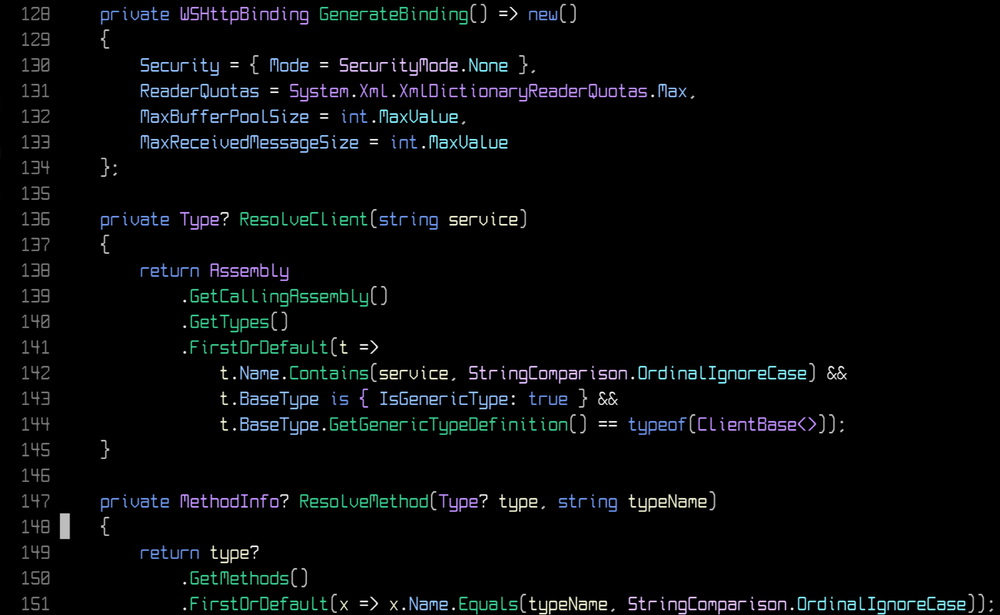

# Gronk

A custom theme based on Rider Dark that is OLED friendly.



### Setup

Lazy
```lua
return {
  "mbwilding/gronk.nvim",
  lazy = false,
  priority = 1000,
  config = function()
    vim.cmd([[colorscheme gronk]])
  end,
}
```
