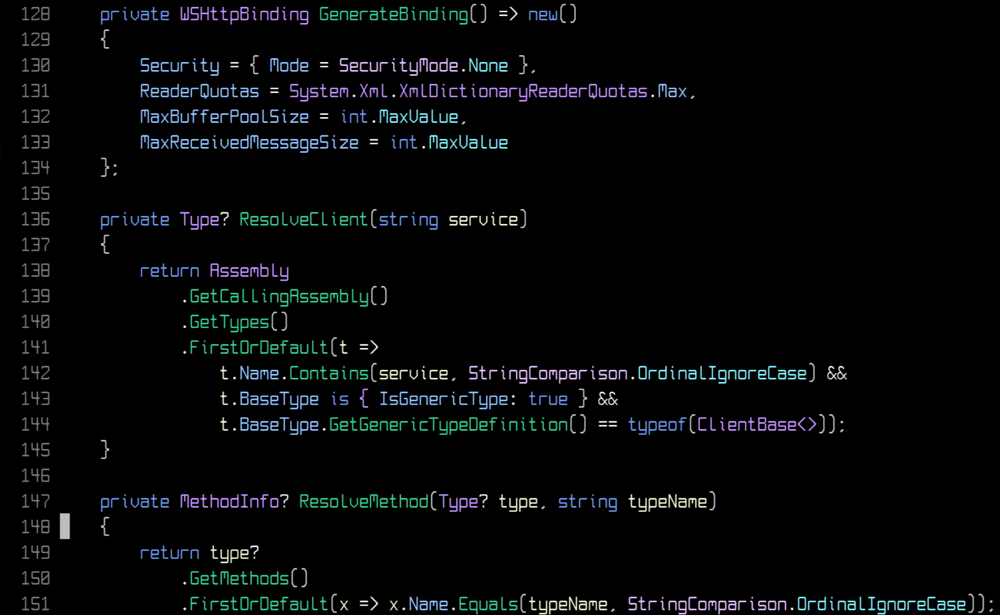

# Gronk

A custom theme based on Rider Dark that is OLED friendly.



### Setup

Lazy

```lua
return {
  "mbwilding/gronk.nvim",
  lazy = false,
  priority = 1000,
  config = function()
    -- Optional setup
    require("gronk").setup({
        transparent = true,
    })

    -- Sets theme
    vim.cmd([[colorscheme gronk]])
  end,
}
```

## Nix

```bash
nix run github:mbwilding/gronk.nvim#gronk-vscode
```

Add the flake as an input (`inputs.nixpkgs.follows = "nixpkgs"`) and use `inputs.gronk.nvim.packages.${pkgs.stdenv.hostPlatform.system}.gronk-vscode`. An overlay is exported as `overlays.default`. Nothing needs editing on release, updating the flake input picks up the latest.
